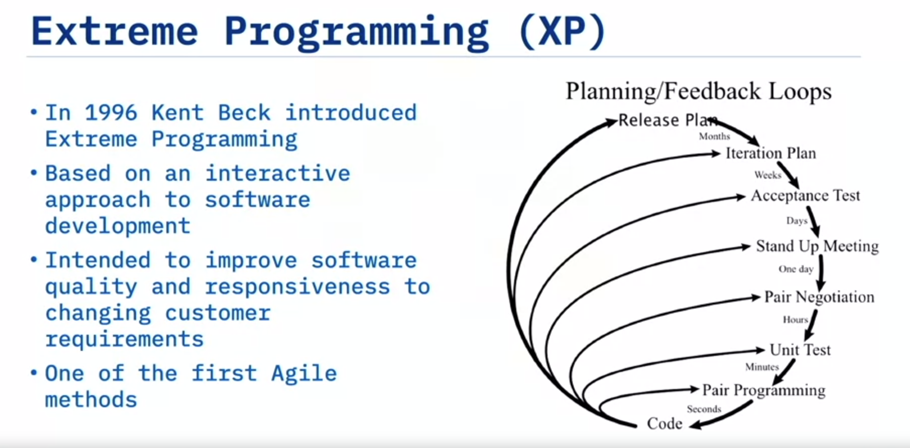

- What is Agile?
    - Agile is an iterative approach to project management that helps teams be responsive and deliver value to their customers faster.

- Agile Defining Charactestics:
    - Adaptive Planning 
    - Evolutionary Development
    - Early Dekivery
    - Continual Improvement
    - Responsive to changes

- Agile Manifesto: 
    - We have come to value:Individuals & Interactions over process & tools working software over comprehensive documentaion. Customer colaboartion over contract negotiations. Responding to chnage over following plans.

- Problems with waterfall model:

    - No provisions for changing requirements.
    - No Idea if it works until the ends.
    - Each step ends when the next begins.
    - Mistake found in the later stages are more expensive to fix.
    - Ther usually a long time between software release.
    - Team works separately and unaware of their impact on each others.

- Xtreme programming(XP)

    - XP Values:
        - Simplicity
        - Communication
        - Feedback
        - Respect
        - Courage

- Kanban
    - A Japanese manufacturing systems in which the supply of components is regulated through the use of an instruction card sent along the production line.
    - Core Principle of Kanban:
        - Visualize the workflow
        - Limit work in progress
        - Manage and Enhance the flow.
        - Making Policies explicits.
        - Continously improve

- Working Agile
    - Working in small batch
    - Minimum viable product
    - Beahavior Driven Development(BDD)
    - Test Driven Development(TDD)
    - Pair programming

- Scrum 
    - Scrum is a methodology follow agile philosopy

