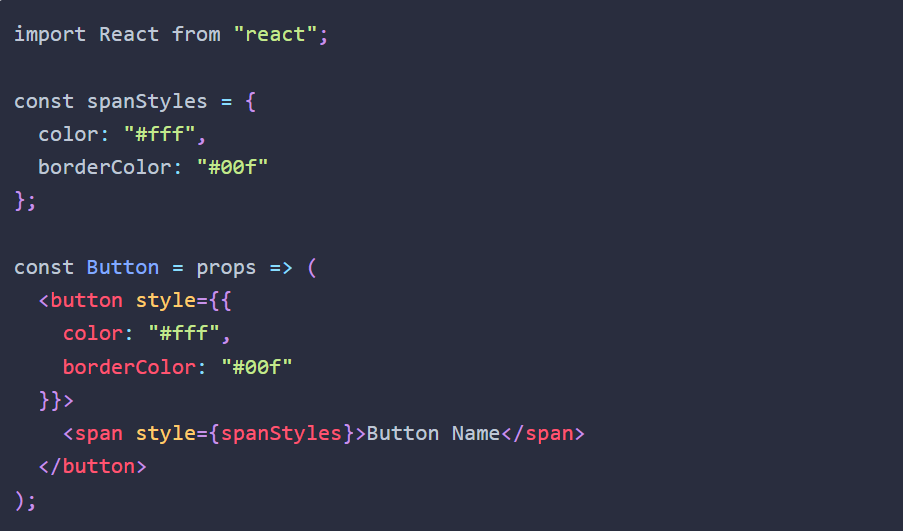
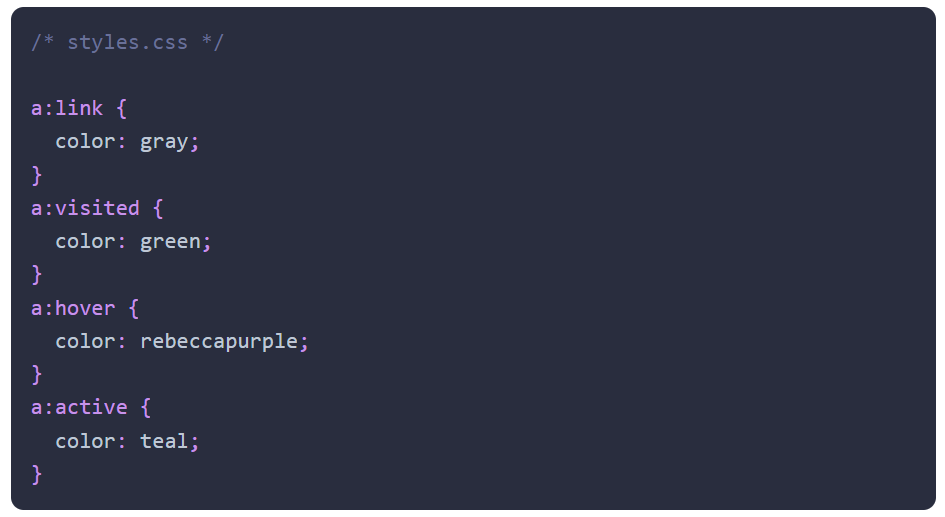
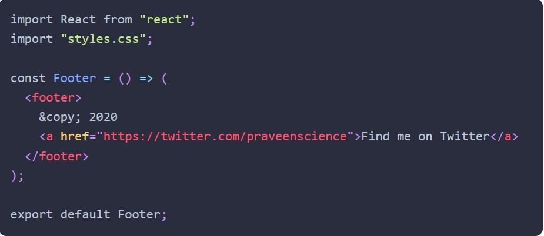
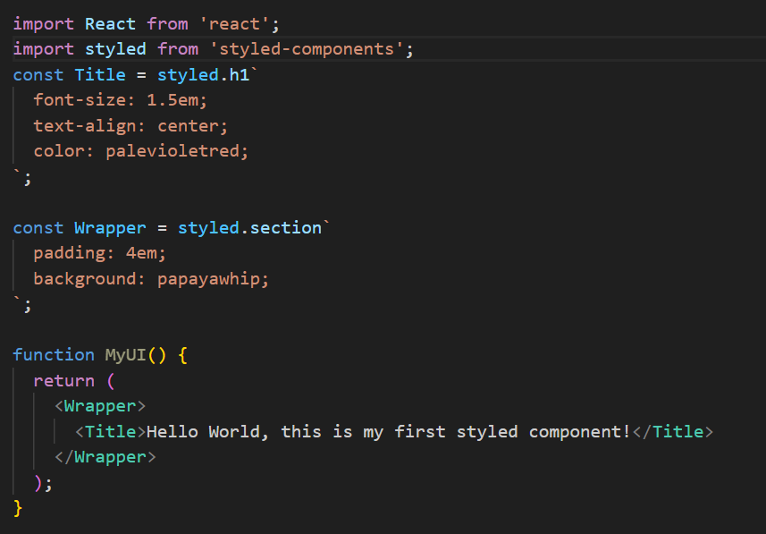
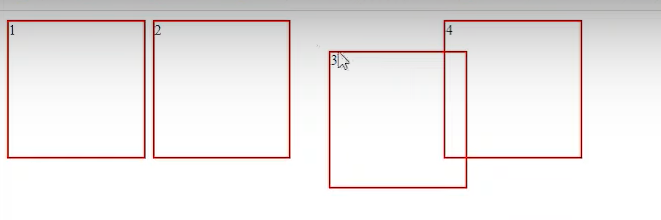
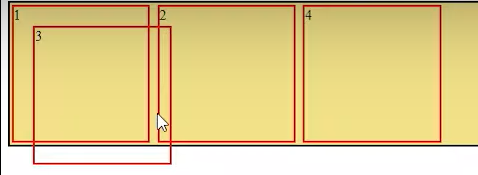
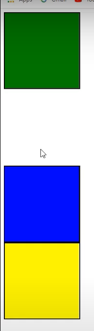
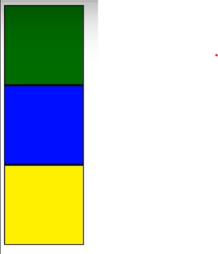

- ID vs Class
    - Id is for uniquely identify.(Not duplicate or double)
    - Multiple elemnts can have same class.

- 8 Way to style javascript components
    - Inline CSS
    - Normal CSS
    - CSS in JS
    - Styled Components
    - CSS module
    - Sass & Scss
    - Less
    - Styleable


- 1.Inline CSS
    - Difficulty: Easy
    - Approach: Worst
    - 
    - Problem(CaleCase,Complex,Not User friendly)

- 2. Normal CSS
    - Difficult: Easy
    - Approach: Okay
    - Create another .css file then import
    - 
    - 

- 3 Styled Components
    - Styled-components is a library that allows you to write CSS in JS while building custom components in Reactjs
    - 


- Position Properties
    - 1. Static(Default)
    - 2. Relative(Old position based shift or change,current Position)
    - 
    - 3. Absolute(Parent or root based shift or change,current )
    - 
    - 4. Fixed(By scrolling but position still same,no effect on scroll.)
    - 5. Sticky(Fixed on Navbar,scrolling not affect on navbar)


- Z-index
    - Visibility Hidden(Not Remove Sapce)
    - 
    - Display-None(Also Remove Space)
    - 
    - Z index (One type of priority)
    - If two box has z index 23,55 obiviosly box 55 must show   either overlap occured.


- Padding
    - Space between content and broder of the elements.It adds spacing inside the element.
    - CSS Provides:
        - padding-top
        - padding-right
        - padding-bottom
        - padding-left
    - padding: 25px 50px 75px 100px;(top,right,bottom,left)
    - padding: 25px 50px 75px;(top-25px,right & left-50px,bottom-75px)
    - padding: 25px 50px;(top & bottom-25, right & left-50px)
    - padding - 25px(all position 25px)


- Margin 
    - Used to create space around elements, outside of any defined borders
    - CSS Provides:
        - Margin-top
        - Margin-right
        - Margin-bottom
        - Margin-left
    - Margin: 25px 50px 75px 100px;(top,right,bottom,left)
    - Margin: 25px 50px 75px;(top-25px,right & left-50px,bottom-75px)
    - Margin: 25px 50px;(top & bottom-25, right & left-50px)
    - Margin - 25px(all position 25px)


- CSS Reset Code 
    - Browser has different built in style ,default margin,padding and son many extra feature.User force to stop all those built in default style.
    ```css
    *{
        margin:0px;
        padding:0px;
    }
    ```

-  SASS Variables
    - Using SASS variables we can use differnt type likes:string,int,bool,list,colors,null
    ```css
    //Declare Variable
    $headr-colr:#FFFFFF
    .header{
        background-color:$header-color;
    }
    ```