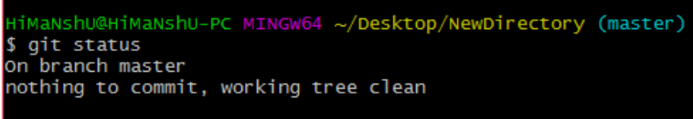

- What is git?
    - Git is a tool for version controls,keep track of changes,colaboration on project.
- What is Github?
    - Github is a service,it host the source code.

- Git Common Command:
    - git init 
        - Initialize a local Git repository
    - git clone
        - Create a local copy of a remote    repository
    - git status
        - Check Status
    - git add
        - Add a file to stagging area
    - git commit
        - Commit changes to repository
    - <h2>Branching & Merging</h2>
    - git branch
        - List branches of all branch
    - git branch [ branch name]
        - Create a new branch
    - git branch -d [branch name]
        - Delete a branch
    - git push origin --delete [branch name]
        - Delete a remote branch
    - git checkout[branch name]
        - Switch to a branch
    - git checkout -b [branch name]
        - Create a new branch and switch to it
    - git checkout -
        - Switch to branch last checkout
    - git merge [branch name]
        - Merge a branch into the active branch
    - git merge [source branch] [target branch]
        - Merge a branch into a target branch
    - <h2>Sharing & Updating Projects</h2>
    - git push origin [branch name]
         - Push a branch to your remote repository
    - git push -u origin [branch name]
        - Push changes to remote repository
    - git push origin --delete [branch name]
        - Delete a remote branch
    - git pull
        - Update local repository to the newest commit
    - git pull origin [branch name]
        - Pull changes from remote repository
    - git remote add origin https://github.com/Md-Roni024/Hello_2024.git
        - Add a remote repository
    - <h2>Inspection & Comparison</h2>
    - git log
        - View Changes
    - git log --oneline 
        - View Chnage Briefly
    - git diff [source branch] [target branch] 
        - Preview changes before merging

