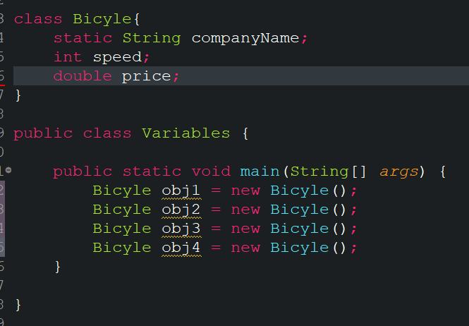

- Variable
    - Variable is a name it used to store data and it's refer a memory location.
    - Java has 4 types of variables:
        1. Instance variable(Non-static)
        2. Class variable(Static field)
        3. Local Variable
        4. Parameter variables
    - 
    - Here CompanyName is only one; But speed and price is 4 copy.

- Data Type
    - Two types of Data in Java
    1. Primitive Type
    2. Reference Type
    - Primitive type has default value.
        - Boolaean=false
        - Byte=0
        - Short=0
        - Char='\u000'
        - int = 0
        - Long= 0L
        - Float = 0.0f
        - Double = 0.0d
    - Autoboxing and Unboxing
        - Autoboxing
        - Refference type <- Primitive type
          ```java
            Integer a=15;
            int b = a;
          ```
        - Unboxing
        - Primitive type <- Refference type
          ```java
            Integer a=15;
            int b = a;
          ```
    - Numerical Literals
        - Big Number can be write as Numerical literals. Like
          ```java
          int a = 11234_45_54;
          //output:112344554;
          float b = 23_13.9_0907_97;[Underscore must be within number that means 5_8,99_77 possible]
          int c = 0b111_00_11;
          int d = 0x233_b434;
          ```

    - Operator in Java
        - Assignment Operator
        - Arithmatic Operator
        - String Operation
        - Unary Operator
        - Equality or Relational OPerator

    - Overflow & Underflow
        - Overflow or Underflow java don't show any error.
          ```java
          int a = Integer.MAX_VALUE;
          int b = a + 5;
          int c = a*b;
          //Here overflow occur

          int d = 1;
          int e = 5;
          //(d/e)=0  underflow
          ```

    - Type conversion
        - <span style="color:green">Wideening Primitive Conversion</span> (small to Large that means small data keep in large data)
        - <span style="color:green">Narrowing Primitive Conversion</span> (large to small that means large data keep in small data)