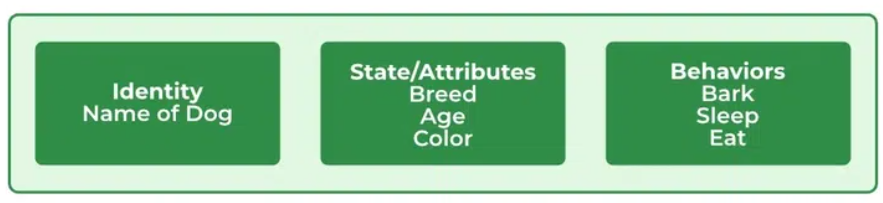
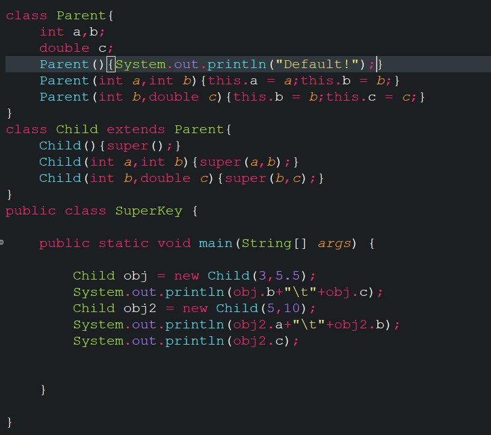
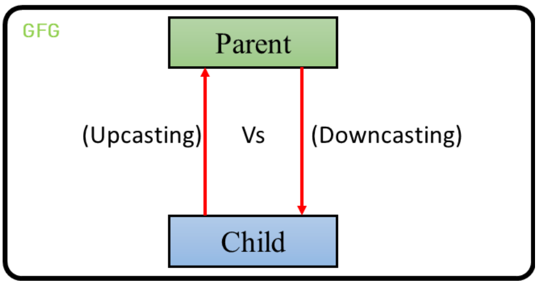

- Class
    - Class is not a real-world entity. It's just a template or blueprint or prototype from where object is creat
    - Class does not occupy memory.
    - Class is group of variables,method and datatypes.
    - Class is logical entity.
    - Class contains
        - variables
        - Method
        - Constructor
        - Nested Class

- Object
    - Instance of a class
    - Memory is allocated when object is instantiate
    - Object is Physical entity.
    - An object has 3 entites:
        - State [Properties/Atributes of an object]
        - Behavior [Behavir or functionality]
        - Identity [Unique Name]

        

- OOP is based on following three concepts:
    1. Inheritance
    2. Polymorphism
    3. Encapsulation

    - Inheritance:
        - IS-A relationship means Inheritance
        - HAS-A relationship means Object Composition.
        - Constructor never inherite, child class must invoke super class constructor.

    - Super Keyword
        - Use to invoke parent/super class constructor
        - Parent class method/variables

        

    - Final Keyword
        - The final keyword in java is used to restrict the user to extends whatever declare by final;
        - Final variable cant't change
        - FInal class can't inherit
        - Final method can't override.
- Method Overrriding
    - If childclass override/provide a specific implementation of a method that already provide by it's super/parent class.


    - Method Overriding Rules
        - same name,same return type & same parameter list.
    - Common Question on Method Overriding.
        - Can constructor overriden?
            - No. Constructor can't be overriden because constructor is not inherite. Inharitance mus happen for method ovveride.
        - Can final method overriden?
            - Final method nver inherit that's why not possibleto override.Like constructor.
        - Can static method ovveride?
            - No. Static method can't be overridden.
    - Static or Early Binfing Vs Dynamic or Late Binding
        - Static or Early binding happen in compile time when program is run. Method overloading is an example.

        - Dynamic or Late Binding happenn in runtime. Method override is an example.

- Upcasting and Downcasting
    - <span style="color:red">Upcasting</span>
    - Keep child object to Parent object
      ```java
        Parent obj = new Child();
        Parent obj = (Parent) new Child();
      ```
    - Access child class override method and inherted elements.It's called generalization.
      ```java
      Parent p = new Child()
Child c = (Child)p;
      ```

    - <span style="color:red">Downcasting</span>
    - Parent object to child object.
    

- Abstract class
    - Can't create object/Instantiate.
    - Subclass called concrete class
    - Constructor of abstract class called by subclass super keyword.
    - Abstract class and method can't private.
    - Abstract constructor can't private.
    - Abstract class may present abstract method or not.
    - child may or may not abstract class.