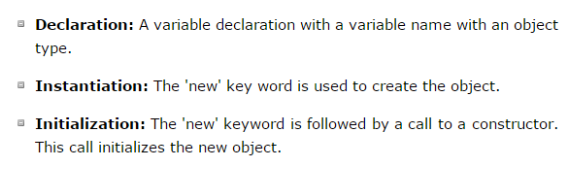

- What is Java?
    - OOP Programming Language
    - Multi-platform
    - Open Source
    - High Level Language
    - WORA(Write Once And Run   Everywhere): Means Java code can run on all platforms that support Java without the need for recompilation

- Why Java is Used?
    - Mobile Application
    - Desktop Application
    - Web Server and Application Server
    - Games & Database Connection

- Java Compiler or Interpreter?
    - Both Compiler & Interpreter
    - Firstly Java Source code compiled to bytecode. Then bytecode will interpretd by JVM(Java Virtual Machine)

- Bytecode
    - An intermediate code compiled by java compiler and it's not exactly human readable nor machine readble code.
    - 

- What is JVM?
    - JVM means 'Java Virtual Machine' It's provide a runtime environment for java bytecode. Also it converts 'Bytecode' to machine code. 

- Why Java is Platform Independent and JVM is Platfform dependent?
    - <strong>Java is platform independent</strong> because Java Source code convert to bytec code which makes java portable to run all machine. 
    - <strong>JVM is platform dependent</strong> because JVM has platform specific runtime environment. Differents platform has different rules and setup to execute bytcode.

- JIT(Just In Time) Compiler
    - It's part of JVM. It process the Bytecode for JVM.

- JRE(Java Runtime Environment)
    - It's combination of components and package which need to run java program.
    Like JVM,Standard API,Class Loader.

- JDK(Java Development Kit)
    - A complete package of tools for write java code. It contains JRE,Java Compiler,Debugger,Archiver etc.

- First Java Code Run in Console
    - 
    - > javac Hello.java 
    java Hello

- <h3>Class & Object</h3> 
- Class is a blueprint for an object. Data member and function can be accessed from a class by creating instance of objects.
- An Object is an instance of a Class. When a class is defined, no memory is allocated but when it is instantiated (i.e. an object is created) memory is allocated.

- Object Create
    - Three step we need for create object:
        1. Declaration [class variable create]
        2. Instantiation[ new operator or object create operator]
        3. Initialization [Constructor call]
        

- Function Vs Method
    - Method is concept of OOP and it's realted to class.
    - Function is not related to class/object.
    - Methods Two types:
        1. Static Method
        2. Non-static Method
        - Static Method:
            - They are related with class. Don't need any object to access static method or fields.
        - Non-static Method:
            - They are related with object. Need to create an object access non-static field or methods.

- Method Overloading
    - A class has multiple methods having same name but different in parameters ,it's known as method overloading.
    1. Changing parameter count.
    
    2. Changing parameter type.
    
     N.B: it need to access by: add(5.9f,6.9f) f is need to append if pass as float otherwise it treat as double. Which shows error.Typecast error.

    4. Common Question on Method Overloading.
        1. Can we overload java main method? 
        Answer: Yes we can. Overloaded main which contains (string[] arr) is called by JVM.
        

        2. Can we overload static method? 
        Answer: Yes, we can. Previous question we overload static main method.

        3. Can we overload only change return type? 
        Answer: We can't. 
        

        4. Can constructor overload? 
        Answer: Yes.Just like methods, we can overload constructors for creating objects in different ways.
        

- Advantage of Method Overloading
    1. Improves the Readability and reusability of the program.
    2. Reduces the complexity of the program.

- Constructor
    - Constructor is a special type of method without return type. It's called when instance of class is creat. At the time of calling the constructor, memory for the object is allocated in the memory.Constructor can private/public/protectd but not static/abstract or anything.

    - Constructor Overloading
    

    - Constructor pass to another constructor as object.
    

        - Common Question on Constructor.
            - Can constructor be private/public/protected?  
            Answer: Yes

- Constructor vs Method
    - Constructor must have same name as class,it's not necessary for method.
    - Constructor has no return type,method must have a return type.
    - Constructor are called once at the time of object is created.But method can call any number of times.

- Parameter vs Argument
    - Parameter: : List of Variables in Method Declaration.
    - Argument: Actual value that are pass when when the method is invoked.
    