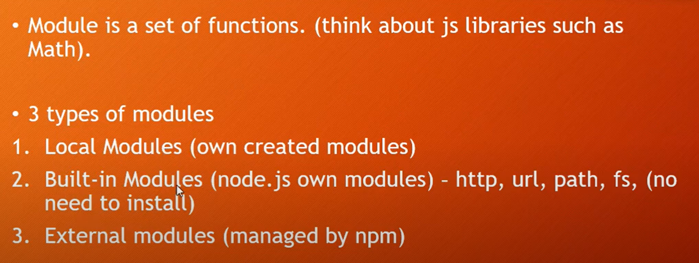
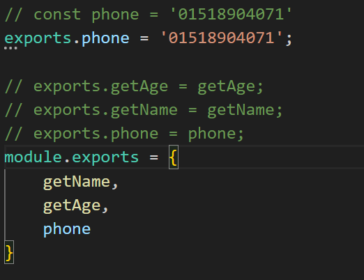
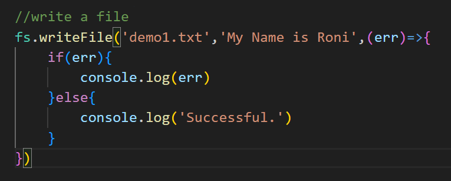
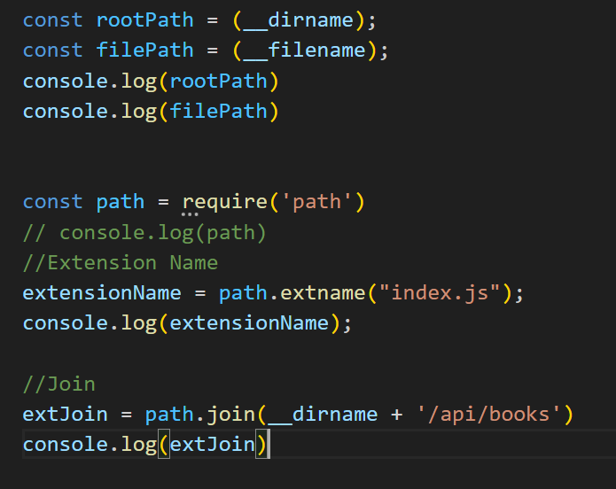
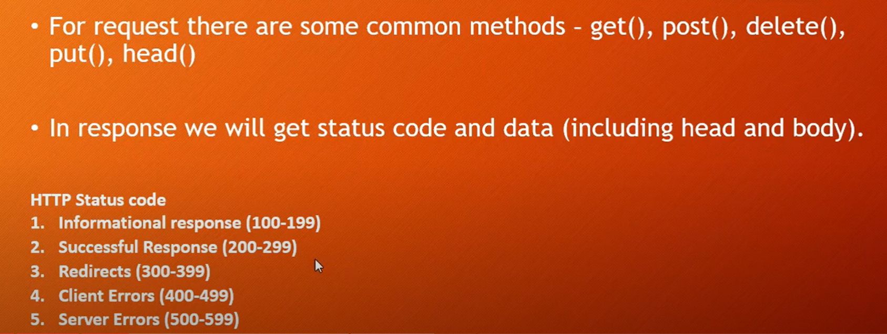
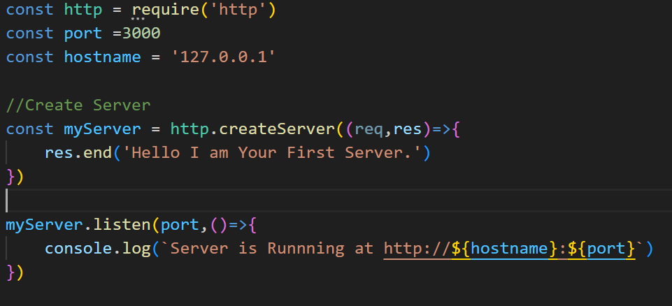

- What is Fullstack
---
     Frontend + Backend
     ClientSide + ServerSide + Database
- What is Node.js
---
    - Node.js is not a programming language.
    - It's a open source Server side Javascript runtime environment 
    - JavaScript was able to run only in the browser, but with Node.js you can run JavaScript in any machine whether is Windows, MacOS, Linux, etc.


- Why Node.js?
---
    - Easy to Learn
    - Easily be Fullstack developer if you have knowledge about frontend like(HTML,CSS,JavaScript)
    - Large ecosystem of opensource libs.
    - It use asynchronus programming.
    - It help us to create,open,read,write,delete and close file in server.


- Aynchronus vs Synchronus in Javascript
---
    - Synchronus: Each instruction waits for the previous instruction to complete its execution.
    - Asynchronus: Means one operation may start before complete previous operation. They can work paralally.
    - Javascript by __deafult synchronus__. But synchronus manner is not efficient when fetch/data load is needed. Thats why async/wait is needed.


- Modules:
---



1. Local Modules:
---
+ Exports && Imports
    - Exports means send exports/send something to others components. They can use exported module by importing their components.
    - 


2. Built in Module(Node.js Module)
    - No need to install ,Just use by importing.
    - Example: path,url,fs,http 
    1. What is fs(file system module)?
        - Example of FS module
            > Assynchronus: writeFile, readFile,appendFile,unLink,exist

            > Synchronus: writeFileSync,readFileSync,unlinkFileSync ...

            > 
    
    2. OS(Operating System) module
        - OS is a node module used to provide information about the computer operating system.(i.e: hostname,homedir,freespace,total space);
            ```js
            const os = require('os')
            //hostName
            console.log(os.hostname())
            //homeDir
            console.log(os.homedir())
            //freeMem
            console.log(os.freemem())
            //totalMem
            console.log(os.totalmem())
            ```
    3. path module
        - The Path Module in Node.js provides the utilities for working with file and directory paths.
        - 

    4. http module
        - Use for create,response,request a server.
        - 
        - 

    
3. External Modules
    - Known as third party module, require a package manager to to maintain all the modules.
    - Need to init npm, then by help of npm we easily access and use npm package.

    
