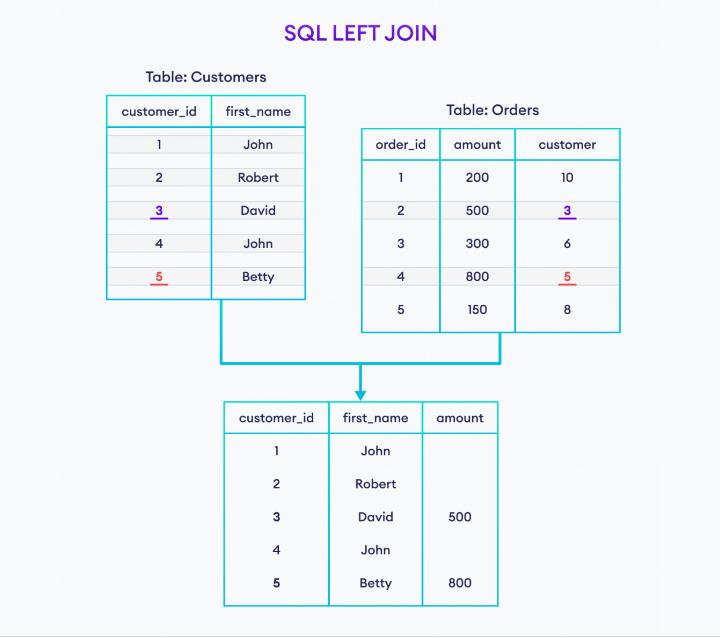
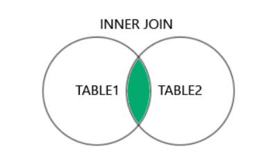
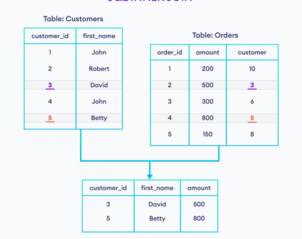
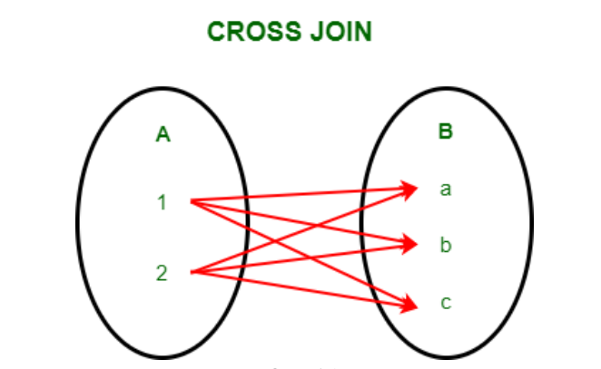
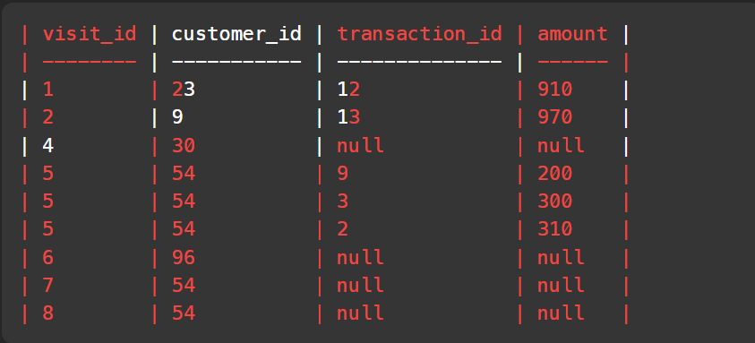
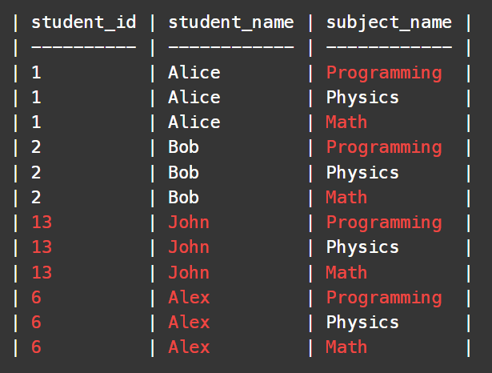
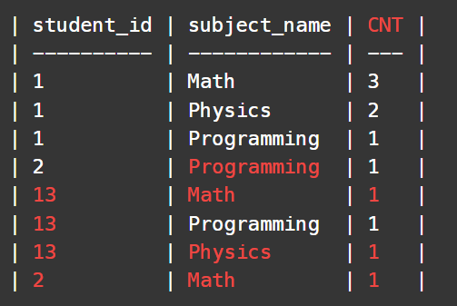

- Left Join
  - SQL <span style="color:red;">lEFT JOIN </span> joins two tabble based on common column. Select all rows from left column and only common rows from right.
  
  - Left Join Code
    ```Sql
    SELECT Customers.customer_id, Customers.first_name, Orders.amount
    FROM Customers
    LEFT JOIN Orders
    ON Customers.customer_id = Orders.customer
    ```
  - left Join example:
  

- INNER JOIN
    - The INNER JOIN command returns rows that have matching values in both tables.
    - 
    - Code:
    ```sql
    SELECT Customers.customer_id, Customers.first_name, Orders.amount
    FROM Customers
    JOIN Orders
    ON Customers.customer_id = Orders.customer;
    ```
    - Inner Join Example:
    

- Cross Join
  - In SQL, a Cross Join is also called a Cartesian Join, it performs cross product of records of two or more joined tables.
  - 
- 1581. Customer Who Visited but Did Not Make Any Transactions
  - ```sql
    SELECT v.visit_id,v.customer_id,t.transaction_id,t.amount from Visits v left join Transactions t on v.visit_id = t.visit_id
    ```
  - 
  - ```sql
    SELECT customer_id, COUNT(v.visit_id) as count_no_trans from Visits v left join Transactions t on v.visit_id = t.visit_id where transaction_id IS NULL GROUP BY customer_id 
    ```

- 1280. Students and Examinations
  ``` sql
  SELECT * from Students cross join Subjects
  ```
  

  ```sql
  SELECT student_id,subject_name,COUNT(subject_name) AS CNT FROM Examinations GROUP BY student_id,subject_name
  ```
  